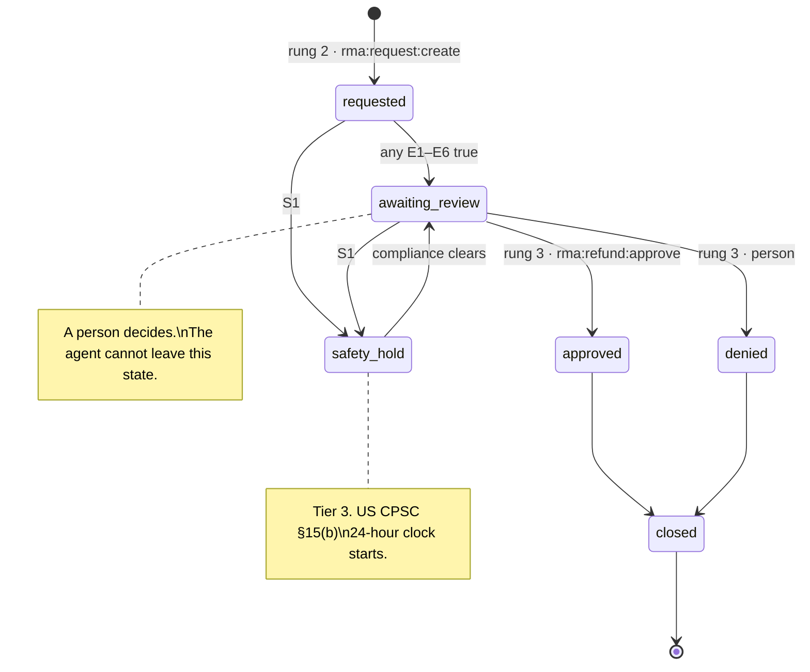
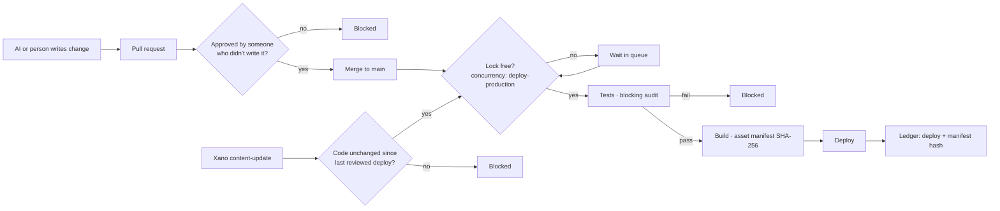
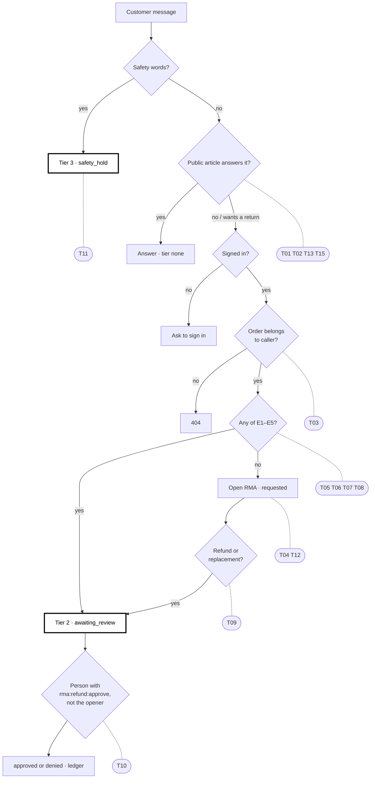

# RMA decision ladder — functional and data design spec (hypothetical)

**Status: hypothetical.** This is a design for discussion, using the HyperX support knowledge base and its chatbot as the worked example. It does not describe a live system. Statements about the current HyperX estate are marked **Observed 2026-10-04** and were checked on that date; everything else is proposed.

The companion diagram shows the same model visually: the four type structures, the mapping onto Xano and the Cloudflare Worker, the functions, and the ladder.


*[Open the diagram full size](https://persephonepunch.github.io/crm-sync-setup/assets/kb-type-structures-rma-ladder.svg).* The Mermaid diagrams in sections 5, 8 and 9 render on [GitHub](https://github.com/persephonepunch/crm-sync-setup/blob/master/RMA-LADDER-SPEC.md); the book shows their source. The principles come from the CRM Sync book: [The AI ladder](https://persephonepunch.github.io/crm-sync-setup/book/ai-ladder-escalation-and-mandates/#4-human-in-the-loop-escalation) for the escalation tiers, [QA and Release Gating](https://persephonepunch.github.io/crm-sync-setup/book/qa-release-gating/#3-the-gate-mechanics) for the gate, and [Secure frontend, AI-safe backend](https://persephonepunch.github.io/crm-sync-setup/book/secure-frontend-ai-safe-backend/) for publishing.

## 1. Scope

In scope: a customer asks the support chatbot about a product, may start a return (RMA), and is handed to a person when a rule says so. Also in scope: what the chatbot may link to (firmware), what code may run around it (browser code), and how changes to it reach production (deploy).

Out of scope: the refund payment itself, warehouse receiving, and the Shopify order lifecycle. The ladder stops at the decision; money moves in the system that owns it.

## 2. Principals

| Principal | Identified by | May | May never |
| --- | --- | --- | --- |
| Visitor | Nothing | Read public articles; ask the chatbot | See any order or case |
| Customer | Signed-in session | Read their own orders and cases; open an RMA | See another customer's rows |
| Chat agent | A mandate from the customer's session: scoped, expiring | Act at rungs 0–2 for that customer | Approve money; hold a refund key |
| Support person | Staff identity with `rma:refund:approve` | Decide rung 3 | Approve their own case |
| Compliance | Staff identity | Handle tier 3; edit internal notes | Change a case outcome |
| Deployer | CI token, one per environment | Deploy a build that passed the gate | Deploy unreviewed code |
| Reviewer | A person who did not author the change | Approve a code change | Approve their own change |

## 3. Data design

Xano is the record; the Cloudflare Worker is the only way out. Every field has one writer.

```yaml
kb_article:
  id: int
  question: text            # required · writer: support editor
  slug: text                # required, unique
  answer: html              # sanitized on the way out
  category_id: ref category # table reference — the Worker checks it resolves
  tag_ids: [ref tag]        # family + product, e.g. cloud-family, cloud-ii-core-wireless
  pdf_key: r2_key?          # manual or quick-start guide
  escalation: enum [none, tier1, tier2, tier3]   # routing carried as content
  is_private: bool          # excluded from every public query

firmware_release:
  id: int
  product_tag_id: ref tag
  version: text
  image_key: r2_key
  sha256: hex               # of the image bytes
  signature: base64         # by the firmware signing key, over sha256
  signer_key_id: text       # which public key verifies it
  sbom_key: r2_key          # CycloneDX or SPDX
  status: enum [draft, attested, revoked]
  attested_at: timestamp?

rma_case:
  id: int
  ref: text                 # e.g. RMA-2026-0187, given to the customer
  customer_id: ref customer # the owner; every read is id AND customer_id
  order_id: ref order       # read-only mirror of the Shopify order
  serial: text
  state: enum [requested, awaiting_review, approved, denied, safety_hold, closed]
  conditions_hit: [condition_id]
  opened_by: enum [agent, person]

escalation:
  id: int
  case_id: ref rma_case?
  tier: enum [tier1, tier2, tier3]
  question: text
  kb_hits: [ref kb_article] # kept even when wrong: that's how gaps are found
  answer: text?
  pair_status: enum [en_only, ko_only, paired]   # derived by the server, never sent
  # FORBIDDEN fields: name, email, phone, address — the record links to the customer by ID only

ledger_entry:
  id: int
  subject: text             # who acted: customer, agent mandate, person, deployer
  cap: text                 # the capability used
  action: text
  target: text
  decided_by: enum [rule, person]
  evidence_sha256: hex?     # build, firmware image or script hash, when there is one
  at: timestamp
```

## 4. Rules as data

The ladder and its conditions are data the Worker reads, not code paths. Changing a threshold is a reviewed data change, not a redeploy.

```yaml
rungs:
  - id: 0
    name: Knowledge base
    who: visitor
    cap: none
    may: [answer_from_public_articles, link_attested_firmware, link_pdf]
    may_not: [read_private_article, read_order]
    tier: none
    up_when: [no_article_answers, customer_asks_to_return]
  - id: 1
    name: Look up
    who: customer
    cap: none            # ownership is the check: id AND customer_id
    may: [read_own_order, read_warranty, check_serial_against_order]
    tier: tier1
    up_when: [all_policy_checks_pass]
  - id: 2
    name: Open an RMA
    who: chat_agent
    cap: rma:request:create
    may: [create_rma_request]
    may_not: [issue_refund, issue_replacement]
    tier: tier1
    up_when: [money_would_move, any_condition_true]
  - id: 3
    name: Person decides
    who: support_person
    cap: rma:refund:approve
    may: [approve_refund, approve_replacement, deny]
    may_not: [approve_own_case]
    tier: tier2

conditions:          # any true → tier 2, a person decides
  E1: { name: outside_warranty_window,   test: "today > order.date + product.warranty_days" }
  E2: { name: serial_mismatch,           test: "serial not in order.serials" }
  E3: { name: repeat_return,             test: "count(rma_case where serial = this.serial) >= 1" }
  E4: { name: over_refund_limit,         test: "order_line.amount > policy.auto_refund_limit" }
  E5: { name: disputed_twice,            test: "customer rejected the answer twice" }
  E6: { name: money_moves,               test: "outcome in [refund, replacement]" }
safety:              # any true → tier 3, immediately, from any rung
  S1: { name: safety_report, test: "overheating | smoke | battery swelling | injury" }
```

Thresholds (`warranty_days`, `auto_refund_limit`) are policy values held in Xano, written by the support lead, and never in the prompt.

## 5. RMA case states



E6 is true for every refund or replacement, so no case reaches `approved` without a person. That is deliberate: rung 2 can open a case on its own, but only rung 3 can close one with money attached.

## 6. Functions

| Function | Principal | Check | Ledger |
| --- | --- | --- | --- |
| `GET /kb/search?q&category&tag` | visitor | `is_private = false` | — |
| `GET /kb/articles/:slug` | visitor | `is_private = false`; firmware links only if `status = attested` | — |
| `POST /chat` | visitor or customer | public articles only; GPC honored; escalation record has no PII | escalation |
| `GET /me/orders/:id` | customer | `id AND customer_id = caller`, else 404 | — |
| `POST /rma` | chat agent | `rma:request:create`; order owned by the mandate's customer | yes |
| `POST /rma/:id/decision` | support person | `rma:refund:approve`; decider ≠ case opener | yes |
| `POST /firmware/:id/attest` | release engineer | signature verifies with `signer_key_id`; SBOM present | yes, with `sha256` |

Paths and cap names are illustrative; caps follow `plane:resource:verb`.

## 7. Verification and attestation

Attestation answers one question for every artifact a customer receives: **can anyone check, after the fact, that this is exactly what we reviewed and released?**

### 7.1 Firmware

The chatbot's most consequential answer is "here is your firmware update". So it may only link firmware the record says is attested.

| Requirement | How it's checked |
| --- | --- |
| The image is signed | `signature` verifies against the public key `signer_key_id`, over `sha256` of the image bytes |
| The SBOM exists | `sbom_key` resolves in R2 and lists the image's components |
| The hash is public | The KB article shows `sha256`, so a customer or support person can compare |
| Only attested images are linked | `GET /kb/articles/:slug` filters `status = attested`; `draft` and `revoked` are never linked |
| Revocation propagates | Setting `revoked` removes the link on the next request; the ledger records who revoked it and why |
| The device verifies before flashing | Required of the updater (NGENUITY or the device bootloader); a valid link is not a substitute |

Background: [Your Firmware Is a URL](https://persephonepunch.github.io/crm-sync-setup/book/cra-evidence-chain/#what-an-sbom-actually-is) and [Firmware Asset Publishing](https://persephonepunch.github.io/crm-sync-setup/book/firmware-asset-publishing/#2-uat-for-a-firmware-publish).

### 7.2 Browser code

Every script on a page that hosts the chatbot runs with that page's full authority. Each one must be either built and deployed through the gate in section 8, or pinned to a known hash.

| Requirement | How it's checked |
| --- | --- |
| Third-party scripts carry SRI | Every `<script src>` from another origin has `integrity="sha384-…"` and `crossorigin` |
| First-party scripts are versioned | `crm-chat.<hash>.js`, not `crm-chat.js`, so SRI can pin it without breaking on each deploy |
| A CSP limits script origins | `Content-Security-Policy: script-src` lists exactly the origins used |
| The deploy records what shipped | The build writes an asset manifest (SHA-256 of every file) and the ledger stores its hash |
| The consent gate is attested | As in [Consent gate attestation](https://persephonepunch.github.io/crm-sync-setup/book/consent-gate-attestation/#how-to-check-this-yourself): measured on the released version, reproducible by anyone |

**Observed 2026-10-04** on `omenphase1-1.webflow.io/knowledge-base-search`:

| Script | SRI |
| --- | --- |
| Webflow runtime and jQuery (5 files) | yes, added by Webflow |
| `crm-chat.js` from `hxphase11ty.pages.dev` (the chatbot) | **no** |
| `kbsearchloader`, `kbdeeplinksearch`, `crmlegalloader` (custom code) | **no** |
| Finsweet list attributes | **no** |
| GSAP and ScrollTrigger (3 files, two origins) | **no** |

13 external scripts, 5 with SRI; no `script-src` policy (the only CSP directive is `frame-ancestors`). The chatbot script is unversioned, so SRI can't be added until its URL carries a hash. See [What SRI is, and where it bites](https://persephonepunch.github.io/crm-sync-setup/book/qa-release-gating/#5-what-sri-is-and-where-it-bites).

## 8. Deploy controls: workflow locks and human review

The gate blocks; it does not report. And the system that generates code must not be the system that judges it: AI-written changes reach production only after a person who didn't write them approves.

| Control | Required | Observed 2026-10-04 in `hxphase11ty/.github/workflows/deploy.yml` |
| --- | --- | --- |
| L1 · Workflow lock | One deploy per environment at a time; a running deploy is never cancelled mid-way | **Absent.** No `concurrency` group; a push and a content dispatch can deploy at once |
| L2 · Code vs content | A content-only deploy (Xano `content-update`) may not ship code that hasn't been reviewed | **Absent.** `repository_dispatch` builds whatever is on `main` |
| L3 · Human review | Code deploys only from a commit merged through a PR approved by someone other than its author | **Absent.** Deploys on any push to `main`. Branch protection and environment reviewers aren't available on this private repo's plan, so the workflow itself must enforce it |
| L4 · Blocking audit | `npm audit --audit-level=high` fails the build | **Informational only** (`|| true`) |
| L5 · Attestation | The build's asset manifest hash is written to the ledger with the deploy | **Absent** |

A minimal change that implements L1, L3 and L4 in the workflow itself:

```yaml
concurrency:
  group: deploy-production       # L1: one at a time
  cancel-in-progress: false      # never kill a deploy halfway

jobs:
  deploy:
    permissions:
      contents: read
      deployments: write
      pull-requests: read        # to read the review on the merged PR
    steps:
      - uses: actions/checkout@v5
      - name: Require a reviewed commit (L3)
        if: github.event_name == 'push'
        env:
          GH_TOKEN: ${{ github.token }}
        run: |
          pr=$(gh api repos/$GITHUB_REPOSITORY/commits/$GITHUB_SHA/pulls --jq '.[0].number // empty')
          [ -n "$pr" ] || { echo "Not merged through a PR: refusing to deploy"; exit 1; }
          author=$(gh api repos/$GITHUB_REPOSITORY/pulls/$pr --jq .user.login)
          ok=$(gh api repos/$GITHUB_REPOSITORY/pulls/$pr/reviews \
               --jq "[.[] | select(.state==\"APPROVED\" and .user.login!=\"$author\")] | length")
          [ "$ok" -gt 0 ] || { echo "PR #$pr has no approval from someone other than $author"; exit 1; }
      - name: Blocking audit (L4)
        run: npm audit --audit-level=high
```

L2 (a content dispatch may only rebuild the last reviewed code) needs the last approved SHA recorded with each deploy, and L5 needs the ledger write. Both are left as open items in section 10.



## 9. Test design

The tests below are written from this spec by a person. They are the fixed target: an AI may generate additional cases against them, but it doesn't write or relax the gate's tests, and a generated test that passes on first run is treated with suspicion.

### 9.1 Test matrix

| ID | Given | When | Then | Covers |
| --- | --- | --- | --- | --- |
| T01 | A private article matching the query | Visitor searches | It isn't returned | rung 0, `is_private` |
| T02 | A private article | The chatbot answers | It isn't used or quoted | rung 0 |
| T03 | Customer A signed in | Requests customer B's order ID | 404, not 403 | rung 1, ownership |
| T04 | In warranty, serial matches, first return, under limit | Chat agent opens an RMA | Case `requested`; no refund issued | rung 2 |
| T05 | Order outside the warranty window | Chat agent opens an RMA | Case `awaiting_review`, `conditions_hit: [E1]` | E1 |
| T06 | Serial not on the order | Chat agent opens an RMA | `awaiting_review`, `[E2]` | E2 |
| T07 | A previous case for the same serial | Chat agent opens an RMA | `awaiting_review`, `[E3]` | E3 |
| T08 | Line amount over the refund limit | Chat agent opens an RMA | `awaiting_review`, `[E4]` | E4 |
| T09 | Any case | Chat agent calls the decision endpoint | Refused: lacks `rma:refund:approve` | rung 3, E6 |
| T10 | A person opened the case | The same person decides it | Refused: decider ≠ opener | rung 3 |
| T11 | Message mentions a swelling battery | At any rung | Tier 3; case `safety_hold`; clock starts | S1 |
| T12 | Any escalation | Record is written | Contains no name, email, phone or address | escalation |
| T13 | Firmware release `draft` | Article links firmware | Not linked | 7.1 |
| T14 | Firmware signature fails verification | Attest is called | Refused; status stays `draft` | 7.1 |
| T15 | Release `revoked` | Next article request | Link is gone; ledger has the revocation | 7.1 |
| T16 | A third-party script without `integrity` | Page check runs | Gate fails, naming the script | 7.2 |
| T17 | Commit pushed straight to `main` | Deploy runs | Refused: not merged through a PR | L3 |
| T18 | PR approved only by its author's account | Deploy runs | Refused | L3 |
| T19 | Two deploys triggered together | Both start | Second waits; neither is cancelled | L1 |
| T20 | `npm audit` reports a high vulnerability | Deploy runs | Build fails | L4 |

### 9.2 Testing diagram

Each decision point in the ladder and the release path, with the tests that hold it.



### 9.3 The gate

- Every test above runs on every pull request and every deploy; a failure blocks.
- Known failures are listed by ID in `tests/known-failures.yml` with an owner, a reason and a date. A listed test that starts passing fails the gate until it's removed from the list.
- A skipped test in this matrix fails the gate.

## 10. Open questions

1. The values of `warranty_days` per product and `auto_refund_limit`, and who signs off changes to them.
2. Which people hold `rma:refund:approve`, and whether high-value cases need two of them.
3. Where the last reviewed SHA is recorded for L2: a GitHub deployment record or the ledger.
4. Whether the Webflow custom-code scripts (`kbsearchloader`, `crmlegalloader`) move into the reviewed repo, so they can be versioned and pinned with SRI.
5. Which updater (NGENUITY or the bootloader) verifies firmware signatures on each product line, and how that is evidenced for the CRA.
