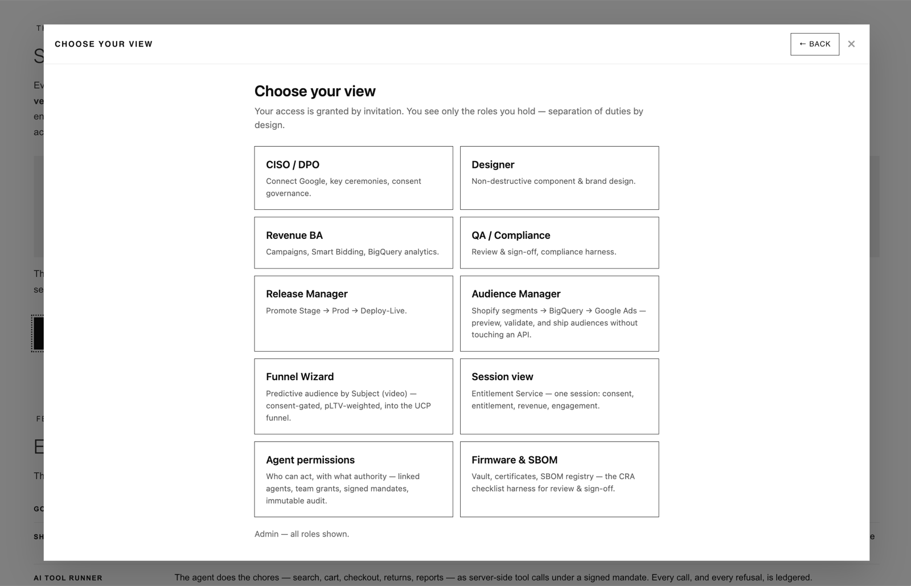
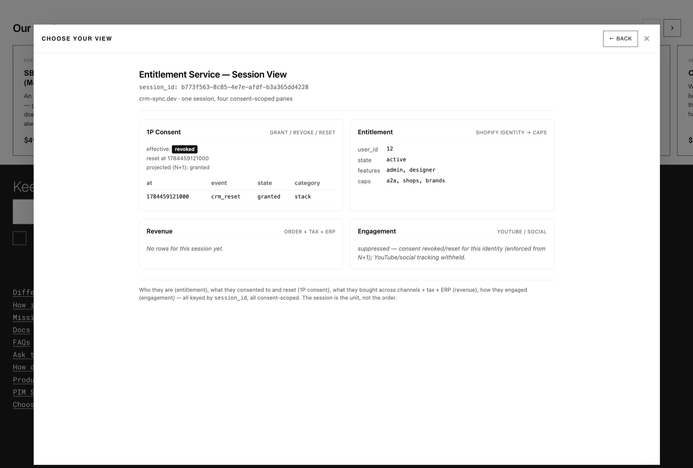

# SOC / SOX Application Review

**Status:** Living reference · **Scope:** The application-review checklist an operator or auditor can walk — IT General Controls (ITGC), AI requirements, dependency & failover — and the Operational Success Management foundation underneath it.

**Tags:** #SOC2 · #SOX · #ITGC · #AI-middleware · #failover · #separation-of-duties

---

## Three promises, one plane

- **AI as free-to-use middleware.** The AI plane costs nothing extra to adopt: no per-seat license, no platform rebuild. Agents ride the entitlements you already run — your systems stay, the AI sits beside them and answers the operational question *while it happens*.
- **Security reinforcement.** Every control fails closed. Consent, mandates, and audit are cryptographic and offline-verifiable — an outage costs throughput, never compliance. The AI does not weaken the estate; it inherits and reinforces the estate's permission model.
- **Data scaling.** One session-keyed universal ledger — orders, tax, consent, engagement — that grows by adding channels, not by re-platforming. Revenue from Shopify today; game and social channels land in the same ledger tomorrow.

SOC-aligned controls and security are **built into the data path, not bolted on** — the checklist below is walkable because the mechanisms already exist.

**Companion reading — why the big-machine rebuild is the wrong-size answer:** [The Wrong-Size Tool](https://www.crm-sync.dev/pages/knowledge-base#wrong-size-tool) walks the public escalation ladder from one ERP scoping failure to material weakness, securities litigation, and delisting. This checklist is the alternative: controls that hold *after* go-live.

*Alignment claim, stated precisely: aligned to the SOC 2 Trust Services Criteria — design-alignment, not an attestation. SOX ITGC domains are the frame external auditors test; the evidence plane here is what your signing officers draw on.*

## ITGC 1 · Access controls

Managing who can access systems and data — provisioning, deprovisioning, periodic review.

- ✓ Access by explicit invitation only; unique identity per human **and** per AI agent
- ✓ Deprovisioning revokes live sessions immediately (token denylist), not just future logins; agent mandates expire on their own clock
- ✓ Least privilege with separation of duties by persona — no single role designs, builds, signs off, and holds keys; reviewers never promote
- ✓ Key lifecycle: ceremony-based rotation on a fixed cadence; secrets never enter logs or transcripts
- Cadence: quarterly access recertification, read from the Agent permissions and Teams views, outcome recorded as evidence

## ITGC 2 · Change management

Changes tested, approved, and documented before deployment.

- ✓ Environment separation: Stage, Production, and a key-gated Deploy-Live realm
- ✓ Author, approver, and deployer are different personas — enforced by role, not policy memo
- ✓ Pre-deploy validation: deploy guards and test harnesses run before anything ships
- Cadence: promotion rides a dedicated `release:promote` capability; deploy-to-commit traceability and the break-glass procedure are part of the standing review

## ITGC 3 · IT operations

Backup and recovery, job scheduling, incident management.

- ✓ Scheduled jobs carry reconcile backstops; every job is idempotent and cursor-gated, so re-runs are safe by construction
- ✓ The system of record is backed up independently of the enforcement cache — the cache can be rebuilt from truth at any time
- ✓ Outage resilience is designed per dependency: writes buffer and replay when a leg recovers
- Cadence: incident runbook (detect → contain → rotate → evidence) and human alerting on control failure

## ITGC 4 · Program development / acquisition

How new systems or major changes are developed or acquired.

- ✓ Security requirements live in the design: consent and entitlement are enforced in the data path
- ✓ A pipeline security baseline governs dependencies and supply chain
- Acquisition is reviewed through the ERP-failure lens — the [seven documented reasons ERP implementations fail](https://www.techtarget.com/searcherp/feature/7-reasons-for-ERP-implementation-failure): unrealistic goals, wrong expertise, operational underestimation, inadequate testing, unverified vendor claims, insufficient stakeholder communication, incomplete requirements. Every one is operational; every one is answerable before commitment, not after.

## AI requirements — ITGC applied to non-human actors

- ✓ **Agent identity.** An agent is never an extension of a human session. It holds its own identity, registry entry, and credential.
- ✓ **Bounded authority.** Authority is a signed, spend-capped, expiring, scope-limited mandate — offline-verifiable against a published public key. No mandate, no money movement; a stale mandate is refused, never settled twice.
- ✓ **Human accountability.** Every agent maps to the accountable human who granted it; grants are team-scoped and revocable.
- ✓ **Consent parity.** Agents are bound by the subject's consent state exactly as trackers are. A revoke gates agent action from the next session forward.
- ✓ **Complete audit, including refusals.** Every agent call — and every denial — lands in an immutable log. Tool-call records are secret-redacted by design.
- ✓ **Constrained tool surface.** Agents act through typed, allowlisted tools; the tool contract is the permission boundary, not free-form access.
- ✓ **The inheritance principle.** An AI deployed into an estate inherits that estate's permission model. If the estate cannot answer *what did the servers do*, neither can its AI. The entitlement plane is what makes an estate AI-deployable at all — and it is free to adopt.
- Cadence: recurring adversarial vetting of agent flows (injection attempts, cap exceedance, revoked-consent purchases), with dated evidence; AI-transparency disclosures tracked alongside the CRA clock.

## Dependency & failover

- ✓ Every dependency is named, with its role and its outage behavior: access and consent **fail closed**; writes queue and reconcile; authorization verifies offline even when every leg is dark
- ✓ Reconciliation is exactly-once — replays cannot double-settle
- ✓ The anti-monolith doctrine is the standing design answer: no single vendor going dark takes the controls with it
- Cadence: per-leg outage drills with retained evidence, and a subservice-organization map recording which controls are inherited from vendor SOC 2 reports versus owned here

## The controls, live

Not a slide — the running product. Two of the review's controls, photographed on this store:

*Separation of duties as a product surface (ITGC 1): access is granted by invitation, and each stakeholder — the DPO, the analyst, QA, the release manager — gets exactly their operational view, including Agent permissions and the Firmware & SBOM harness. Open it live from [the permission baseline on the How page](https://www.crm-sync.dev/pages/how-it-works#permission-baseline).*

*Real-time enforcement, evidenced (AI requirements · consent parity): one session, four consent-scoped panes. The consent revoke is honored — engagement tracking is withheld and says so — and the refusal itself is the audit record. This is the server-side answer to "what did the servers do?"*

## The cost of standing still — AI-speed data on batch-speed infrastructure

AI asks in milliseconds. Batch infrastructure answers in days.

An estate without real-time server functions has exactly two options when agents arrive, and both are expensive: **block the AI** (the revenue and productivity cost of sitting out the platform shift) or **let it act unverified** (the compliance cost of an actor moving faster than your controls can watch). The remediation ladder is public record — the [billion-dollar fine table](https://www.crm-sync.dev/pages/knowledge-base#cybersecurity-for-ai), and the [ERP failure walked to delisting](https://www.crm-sync.dev/pages/knowledge-base#wrong-size-tool). The alternative — consent, entitlement, and evidence enforced at the moment of the event — is not a program. It is middleware that is free to adopt.

### The trust network is already breached

The case for offline-verifiable, short-lived, fail-closed authority is not theoretical. The things estates *trust by default* — the identity providers they delegate authentication to, and the package registries that ship their code — have each been compromised, recently and publicly.

#### The enterprise trust frameworks were the exploit path — Entra and Okta

Enterprises did not merely use Okta and Microsoft Entra; they made them the <strong>trust framework</strong>.

The framework is the party every application defers to on the question *is this session real?* Both frameworks were then exploited, and in neither case did the attacker break the cryptography. They exploited the framework itself:

- **Okta, October 2023.** The identity provider's *own support system* was breached with stolen credentials. Customers had uploaded browser recordings (HAR files) for troubleshooting; those recordings contained **live session tokens**. Files for 134 customer organizations were exposed, and five — including security companies — were then **session-hijacked with no password and no MFA**, because inside the trust framework a session token *is* the identity. Detection came from the customers, not the vendor. ([Krebs on Security](https://krebsonsecurity.com/2023/10/hackers-stole-access-tokens-from-oktas-support-unit/) · [BleepingComputer](https://www.bleepingcomputer.com/news/security/okta-breach-134-customers-exposed-in-october-support-system-hack/))
- **Microsoft Entra, 2023–24.** Storm-0558 obtained a Microsoft signing key and **minted valid authentication tokens** — trusted everywhere the framework was trusted — to read the cloud mailboxes of, among others, U.S. government agencies. The forgeries passed every check, because the check was "signed by the framework." Again the vendor did not detect it; a customer did. ([Cybersecurity Dive](https://www.cybersecuritydive.com/news/okta-customer-support-system-cyberattack/697407/))

That is the structural lesson for every application review: **a trust framework concentrates trust, and concentrated trust is a single point of failure with the largest possible blast radius.** When the framework's key signs, everything opens; when the framework's support desk leaks, every customer's session walks out. An estate whose consent, entitlement, and authorization all reduce to "the IdP said so" inherits the IdP's breach at the moment it happens — and learns about it whenever a *customer* notices.

The controls in this checklist are the counter-shape: authority is verified **per request against keys you publish**, sessions are three-part and revocable **now** (a denylisted token dies at once, not at the next sync window), agent authority is a **separately signed, capped, expiring mandate** rather than an inherited session, and everything **fails closed** when a trusted party goes dark or goes rogue. The trust framework stays — Google sign-in is still the wristband — but it is one input to authorization, never the whole answer.

#### The supply chain shipped the breach — npm

*xkcd #2347, "Dependency" — CC BY-NC 2.5, [xkcd.com/2347](https://xkcd.com/2347/)*

- **September 2025** — the maintainer of `debug`, `chalk`, and 16 other utilities (billions of weekly downloads) was phished through a fake 2FA-reset domain; malicious versions shipped to the whole ecosystem within hours. ([Upwind](https://www.upwind.io/feed/npm-supply-chain-attack-massive-compromise-of-debug-chalk-and-16-other-packages))
- **December 2025** — the self-replicating **Shai-Hulud 2.0** worm harvested roughly 400,000 developer secrets through infected packages' install scripts. ([Unit 42](https://unit42.paloaltonetworks.com/monitoring-npm-supply-chain-attacks/))
- **March 2026 — `axios`** — the HTTP client with 100M+ weekly downloads was published with a cross-platform remote-access trojan via its maintainer's compromised account, attributed to North Korean state activity. ([Trend Micro](https://www.trendmicro.com/en_us/research/26/c/axios-npm-package-compromised.html) · [Microsoft Security](https://www.microsoft.com/en-us/security/blog/2026/04/01/mitigating-the-axios-npm-supply-chain-compromise/) · [Snyk](https://snyk.io/blog/axios-npm-package-compromised-supply-chain-attack-delivers-cross-platform/))

The pattern across all five incidents: **the trust network itself is the attack surface.** Your dependencies ship to you; your identity provider's session is your session. A stolen token that lives for hours on batch-speed identity sync is a breach; the same token on real-time infrastructure dies at revocation — *now*.

What that lesson demands is exactly this checklist's spine: verify authority against **your own published keys**, offline, per request (no inherited vendor trust); tokens that are **short-lived and single-use**; controls that **fail closed** when a trusted party goes dark or goes rogue; and an **SBOM discipline** that can answer "do we ship the compromised version?" in minutes — the question every axios consumer had to answer on March 31, 2026, at whatever speed their inventory allowed.

### Inverting risk into success

The same speed that makes AI a risk from the sidelines becomes the advantage the moment it belongs to the stakeholders who carry the consequences.

The signing officer, the DPO, the analyst who must answer for what the servers did — [each holds an operational view of their own](https://www.crm-sync.dev/pages/how-it-works#permission-baseline), fed at the speed the question arrives: consent enforced at the moment of the event, authority verified per request against published keys, every refusal ledgered as it happens. The alternative is standing on the sidelines inside single-point-of-failure patterns that have already failed in public — [one maintainer's phished inbox](https://www.trendmicro.com/en_us/research/26/c/axios-npm-package-compromised.html), [one support system's session tokens](https://krebsonsecurity.com/2023/10/hackers-stole-access-tokens-from-oktas-support-unit/) — while a remediation program tries to boil an ocean of software that neither resolves the data nor solves the problem; [that ladder has a documented ending](https://www.crm-sync.dev/pages/knowledge-base#wrong-size-tool). The inversion is the whole strategy: don't rebuild the estate to move at AI speed — [put AI beside it as middleware that already moves at that speed](https://www.crm-sync.dev/pages/knowledge-base#cybersecurity-for-ai), free to adopt, so the people who manage the consequences see them coming instead of reading about them in next quarter's disclosure.

## The gaps this review finds in real estates

Four gaps recur in otherwise well-run estates. Each one is a *join that doesn't exist* — two systems that are individually healthy and jointly blind. This is what the review above surfaces, and what middleware closes without replacing either side.

**SAP that doesn't handle RMA.** The ERP owns the order ledger, but the return lifecycle runs somewhere else — a mailbox, a spreadsheet, a channel the ERP never sees. Refunds move money outside the system of record. *Control consequence:* revenue recognition and the completeness assertion break — the exact class of failure that becomes a material-weakness disclosure. *The join:* returns run as a tracked lifecycle whose refund lands back on the immutable order audit, keyed to the same session as the sale.

**Customer service that doesn't link to WMS.** Service makes promises — replacement shipped, return received, refund on the way — that the warehouse cannot confirm and service cannot verify. Promises without evidence. *Control consequence:* the operation attests to states it cannot prove; disputes are decided by whoever kept better notes. *The join:* the fulfillment event is the evidence — service reads the same stamped, ledgered events the warehouse writes.

**Fraud that doesn't link to CRM.** Fraud scoring sees transactions but not the person: no tenure, no consent posture, no history. Loyal customers get declined; serial abusers rotate identities beneath the threshold. *Control consequence:* the control exists but acts on incomplete data — precision failure in both directions, unmeasured. *The join:* one identity spine under every transaction, so risk decisions read the same customer record marketing and service do — and every decline is logged as a refusal, not silence.

**Consent that doesn't link to CRM.** Consent is captured at a banner and stays there. The customer record — and every downstream activation reading it — never learns about the revoke. *Control consequence:* the estate acts on data whose permission was withdrawn; the regulator's server-side question — *what did the servers do after the revoke?* — has no answer. This is the gap behind the fine tables. *The join:* consent is an event on the identity spine, enforced at the data path — a revoke gates segments, engagement, and agents from the next session forward, and the enforcement is itself in the ledger.

Four gaps, one shape: **the record exists, the join doesn't.** The wrong-size answer is replacing the systems that hold the records. The right-size answer is the station between them.

## The foundation: Operational Success Management

ERP implementations fail for operational reasons — all seven documented causes are variants of *the system only looked like it worked until operations asked it a question.* The engineering community has a name for this: **probably-working software.**

<iframe src="https://www.youtube-nocookie.com/embed/DZpR0GojoWQ" title="The dangers of probably-working software — Damian Brady, NDC London 2026" loading="lazy" allow="clipboard-write; encrypted-media; picture-in-picture; web-share" referrerpolicy="strict-origin-when-cross-origin" allowfullscreen></iframe>

*Damian Brady, NDC London 2026 — ["The dangers of probably-working software"](https://youtu.be/DZpR0GojoWQ) (privacy-enhanced player, no tracking cookies before you press play). The dogfood discipline below is the cure: software stops being "probably working" when the operator runs it on themselves and the evidence is public — this store's own consent, orders, and sessions feed the same ledger it sells. The NDC series also carries talks on permissions and identity — the same ground the [AI requirements](#ai-requirements--itgc-applied-to-non-human-actors) section walks.*

The foundation here inverts each failure mode into a standing management discipline. That is Operational Success Management: **operations is not a rollout phase that ends at cutover — it is the thing the product continuously manages, with evidence.**

| ERP failure mode | The OSM discipline | The mechanism |
| --- | --- | --- |
| Unrealistic goals | Verify against live operations before attesting | Go-live wizard: never self-attest — open a real connection |
| Wrong expertise | Architecture before implementation | The station, not another destination; human executes, agent verifies |
| Operational underestimation | Run the product on itself | The store's own consent, orders, and sessions feed its own ledger |
| Inadequate testing | The unhappy paths are the test suite | Fail-closed denials, outage replays, revoked-consent paths deliberately exercised |
| Unverified vendor claims | Every claim ships with its verification | Public-key verify on certificates and mandates; dry-run previews; verify-after-deploy gates |
| Insufficient stakeholder communication | Every stakeholder has an operational view | Choose-your-view personas — BA, QA, DPO, designer, release manager — separation of duties by design |
| Incomplete requirements | Requirements as checkable constraints | Validators and lint over one-time applies; a living gap register |

Go-live is when management starts, not when the project ends. The controls above hold afterward because the same plane that runs the business produces the evidence — in real time, on every change, in systems you own.

---

*Related: [The Wrong-Size Tool](https://www.crm-sync.dev/pages/knowledge-base#wrong-size-tool) · [Cybersecurity for AI](https://www.crm-sync.dev/pages/knowledge-base#cybersecurity-for-ai) · [Security & Compliance Posture](https://www.crm-sync.dev/pages/knowledge-base#security-posture) · [The dangers of probably-working software — NDC London 2026](https://youtu.be/DZpR0GojoWQ) · Print this page for the PDF edition.*
