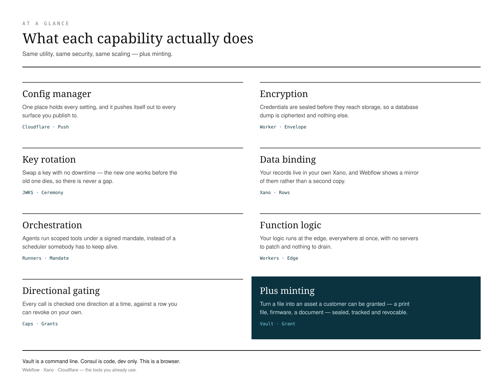
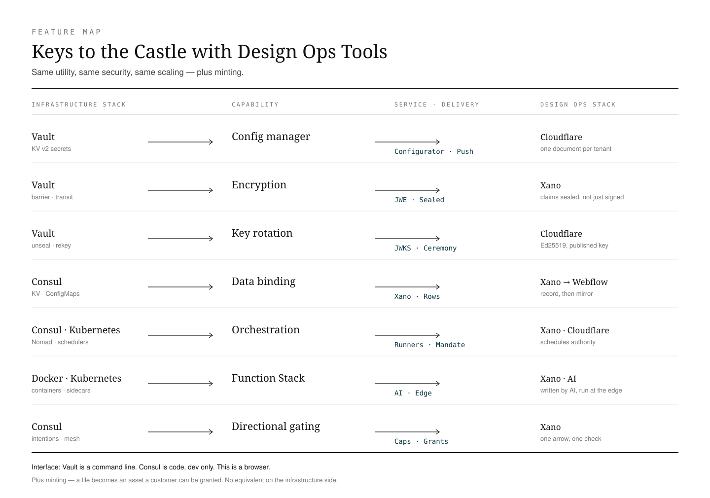

# Keys to the Castle with Design Ops Tools

**Version:** 1.1
**Date:** 2026-08-16
**For:** Designers, design ops and business analysts who already run Webflow, Xano and Cloudflare.

> **You want security with the tools you use.**
> Not a second stack. Not a ticket to a team that owns the terminal. The same protections an infrastructure team runs, in the tools already open on your screen.

---

## What you actually get

| | |
|---|---|
| **Same utility** | Hold credentials, push settings to every surface, keep one source of truth. The everyday job, unchanged. |
| **Same security** | Credentials encrypted at rest. Signatures anyone can check. Keys that expire and can be revoked. A log that cannot be quietly edited. |
| **Same scaling** | Runs at the edge, everywhere at once. Nothing to keep alive, nothing to patch at 2am. |
| **Plus minting** | Something a secrets engine was never built to do: turn a **file** into an asset a customer can be *granted* — a 3D print file, firmware, a document — sealed, tracked, and revocable. |

That last row is the one with no equivalent on the other side. Vault protects secrets. This protects secrets *and* the things you sell.

---

*Feature by feature against the infrastructure equivalents:*

---

## Start with the interface

Before any feature row, the thing that quietly decides everything: **how you actually use it.**

This is the difference between a tool you can pick up and a tool you have to be granted access to.

| | Interface | What that means |
|---|---|---|
| **Vault** | Command line | The `vault` binary and an HTTP API. There is a web console, but it is an *operator* console — it assumes you already know policies, engines, mount paths and lease semantics. |
| **Consul** | Code, dev only | Service definitions, intentions and proxy config are written as HCL and manifests and shipped through a pipeline. The UI observes a topology it cannot author. |
| **CRM Sync** | A browser | The configurator and the Designer Extension, on Webflow, Xano and Cloudflare. Set a policy, mint a key, revoke a grant, read the ledger — no terminal. |

This is not packaging trivia. **A control that exists only behind a CLI belongs to whoever has the CLI.** That is a real access-control decision, made accidentally, and it is why governance work queues behind a platform team that never asked for it.

The primitives are the same. The gate is who is allowed to hold them.

---

## Vault → the config manager

Vault is a secrets engine. The config manager is a propagation plane that stores secrets along the way. Close on primitives, divergent on delivery.

| Vault concept | What it is there | On Webflow / Xano / Cloudflare | Position |
|---|---|---|---|
| Barrier encryption | Every write encrypted before storage sees it | AES-256-GCM per-document envelope in KV, KEK derived with HKDF | Parity |
| Transit engine | Sign and encrypt as a service | Ed25519 signing in the Worker, public half at `/.well-known/jwks.json` | **CRM Sync** |
| KV v2 secrets | Versioned storage with rollback | One config document per tenant. Rollback comes from Xano and Webflow's ~15-minute point-in-time restore, not the blob | **Vault** |
| HCL policies | Path-based ACLs per capability | Capability grants plus field-level authority — platform-owned fields stripped from tenant writes | **Vault** |
| Auth methods | AppRole, OIDC, Kubernetes, cert, cloud IAM | Bearer keys for machines; humans carry a Xano-issued **JWE** minted per auth event, claims sealed through every hop | Different |
| Leases and TTL | Every secret renewable and revocable | Token leases with a preflight check, 600-second entitlements, 120-second asset links, optional expiry at mint | Partial |
| Audit devices | Every request logged, sensitive values HMAC'd | Hash-chained ledger in D1 where `UNIQUE(tenant, stream, prev_hash)` is the compare-and-swap — a break is detectable | **CRM Sync** |
| Namespaces | Partitions inside one cluster you operate | Ownership instead of partitioning — the customer brings their own Xano workspace, so there is no shared store to misconfigure | **CRM Sync** |
| Dynamic secrets | Creates a real downstream credential, valid for minutes | Not for downstream systems. Shopify, Xano and Google credentials are long-lived and stored, which is what the envelope protects | **Vault** |
| Unseal ceremony | Shamir quorum or KMS auto-unseal after restart | No seal state. Rotation is the ceremony, and it is two-role: the human executes the privileged write, the agent prepares and verifies | Different |

---

## Consul → the Worker and its runners

Vault maps concept by concept. Consul does not, and that is the interesting part.

Consul exists to make a **fleet** of services find each other, prove who they are and stay healthy. Most of what it does answers questions a fleet creates. Remove the fleet and those questions do not get better answers — they stop being asked.

| Consul concept | In Docker / Kubernetes | On Webflow / Xano / Cloudflare | Position |
|---|---|---|---|
| Interface | HCL, manifests, Envoy config through a pipeline | A browser. Changing who may call what is a grant on a row, not a commit and a deploy | **CRM Sync** |
| Service catalog | Services register so others can locate them | Nothing to discover — one Worker. `/stack/config` advertises the planes; agents read `/.well-known/agent-card.json` | *Collapses* |
| Health checking | Liveness and readiness probes; is the process up? | `/health`, plus `preflightTokens()` — asks whether the **credential** is still valid before a destructive job. A healthy process holding an expired token is exactly how a truncated read once read as an empty set | **CRM Sync** |
| Consul KV | Distributed key/value fronting ConfigMaps | The tenant config document, already edge-replicated — the same plane as above, not a second store | Parity |
| Connect service mesh | An Envoy sidecar per pod, mTLS between them | No sidecar, no pod-to-pod hop. Trust rides *in the call*: an Ed25519-signed mandate verified per action against a published key | Different |
| Intentions | Declarative service-to-service allow/deny | `caps.a2a` — agent-to-agent authorization as a capability grant on a row, revocable individually and immediately | **CRM Sync** |
| DNS interface | CoreDNS resolves `svc.consul` names | Worker routes. No internal service names because there are no internal services | *Collapses* |
| Multi-datacenter federation | WAN gossip joins clusters; failover to a replica | Three **independent** legs — Cloudflare, Xano, Shopify — each authoritative for a different slice. Failing over is not restoring a copy | **CRM Sync** |
| Rolling deploy | Drain, replace, wait for readiness, repeat | One artifact, one `wrangler deploy`, global in seconds. No drain because there is no instance to drain | **CRM Sync** |
| Scheduler (Nomad / K8s) | Places and restarts long-running workloads | The **runners**: an agent loop at `/mcp` executing scoped tools under a signed mandate, authorized by a row at call time and ledgered. It schedules *authority*, not processes | Different |

**Consul asks:** which instance should I talk to, and can I trust it?
**The runner asks:** is this actor allowed to do this, right now?

---

## Keys to the Castle — distributed entitlement

The feature rows above describe *what* each system does. This is the shape underneath, and it is the reason the rows come out the way they do.

**Vault is a vault.** That is not a criticism — it is the design. One guarded store, a barrier around it, a door you authenticate at. Everything Vault does well follows from concentrating the valuable thing in one place and defending that place extremely competently.

**Distributed entitlement is the opposite shape.** The value does not sit in one store. Card data stays in Shopify. Identity and consent stay in Xano — in the customer's own instance. Draft content is a Webflow mirror, not a source. What travels between them is not the secret but a **grant**: signed, scoped, revocable, and verifiable against a published key by anyone, without calling us.

The consequence is the whole argument:

> Keep the castle. Keep the moat. But being *inside* the walls no longer grants you anything — every request is re-verified per action. The castle governs access; it does not store the treasure.

A single store of everything is simultaneously the biggest prize and the tightest bottleneck. Breach a distributed shape and you get a fragment, never the hoard. And because the value is spread out *for people and agents to use*, distributing it **is** the accessibility — security and reach in the same move, which is normally the trade you are asked to make.

<iframe src="https://www.youtube-nocookie.com/embed/jp7sOvo1a6Y" title="Keys to the Castle — CRM Sync" style="position:absolute;top:0;left:0;width:100%;height:100%;border:0" allow="accelerometer; autoplay; clipboard-write; encrypted-media; gyroscope; picture-in-picture; web-share" referrerpolicy="strict-origin-when-cross-origin" allowfullscreen loading="lazy"></iframe>

*Keys to the Castle — three minutes. Privacy-enhanced: YouTube sets no tracking cookie until you press play. The written version is at [crm-sync.dev/keep-the-castle](https://crm-sync.dev/keep-the-castle).*

---

## Where HashiCorp is still the right answer

A comparison that only flatters itself is not evidence.

**Vault** — dynamic database credentials, acting as a private PKI certificate authority, SSH certificate signing, and the breadth of its secret-engine ecosystem. If you need a credential minted inside a downstream system and destroyed minutes later, that is Vault's signature feature and there is no equivalent here. Vault also wins on policy depth and on versioned rollback of the secret itself.

**Consul** — anything with a genuine fleet: stateful workloads, long-running processes, GPU jobs, services that must live in containers you control. If pods really do need to find and authenticate each other, you need a mesh, and none of the above replaces one.

The claim is narrower than displacement. For a team whose surface is a website, a catalogue and a set of agents acting on a customer's behalf, the fleet was never the shape of the problem — and the operational cost of governing one is exactly the part a designer or BA cannot carry.

---
