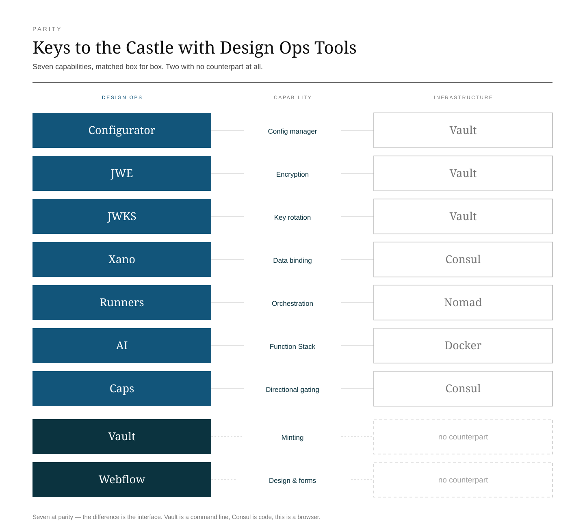
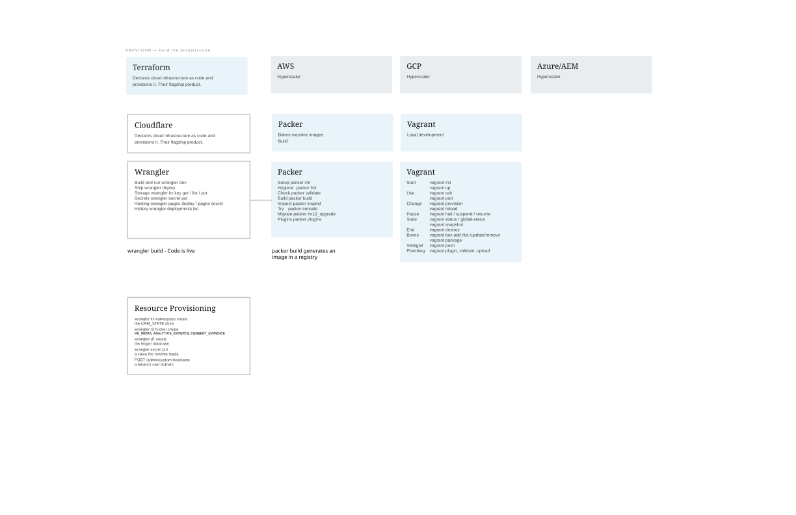

# Keys to the Castle with Design Ops Tools

**Version:** 1.1
**Date:** 2026-08-16
**For:** Designers, design ops and business analysts who already run Webflow, Xano and Cloudflare.

> **You want security with the tools you use.**
> Not a second stack. Not a ticket to a team that owns the terminal. The same protections an infrastructure team runs, in the tools already open on your screen.

---

<iframe src="https://www.youtube-nocookie.com/embed/jp7sOvo1a6Y" title="Keys to the Castle — CRM Sync" style="position:absolute;top:0;left:0;width:100%;height:100%;border:0" allow="accelerometer; autoplay; clipboard-write; encrypted-media; gyroscope; picture-in-picture; web-share" referrerpolicy="strict-origin-when-cross-origin" allowfullscreen loading="lazy"></iframe>

*Keys to the Castle — three minutes. Privacy-enhanced: YouTube sets no tracking cookie until you press play. The written version is at [crm-sync.dev/keep-the-castle](https://crm-sync.dev/keep-the-castle).*

---

## The divides

Your customer data lives in a dozen systems that do not talk to each other — ERP, CRM, DAM, PIM, WMS, returns and customer service — and every team builds a taller wall around its own island.

The safest-sounding answer is to put it all in one place. That is the one that will hurt you most.

---

## The monolith, and the incumbent's mistake

So the islands slide together into one structure. A single build, a single database, every valuable thing behind one set of walls. For years that was simply how software was made, and it was not a mistake.

**The mistake is not having walls. It is hoarding all the gold in one vault behind them.**

That vault is the blast radius: one breach takes everything. And while it sits there, the hoarding also locks the value away from the people who need it. A single store of everything is simultaneously the biggest prize and the tightest bottleneck.

> **The fortress is the breach.**

---

## Keep the castle. Keep the moat.

None of this means tearing down the perimeter. The firewall stands, the DDoS shield stands, the edge governance stands. Keep every one of them.

What changes is what being inside them earns you. **Nothing.** Every request is re-verified, per action, whether it arrives from the open internet or from a service that has been running inside the walls for a year.

> **The castle governs access. It does not store the treasure.**

---

## Distribute the gold

Instead of one vault, the value sits in many pockets — each in the system genuinely authoritative for it.

| What | Where it lives |
|---|---|
| Card data | Shopify — never touched, never mirrored |
| Identity and consent | Xano — your own instance, your key |
| Draft content | Webflow — a mirror, not a source |
| Grants and mandates | Signed, verifiable with a public key |

Breach one and you get a fragment, never the hoard. There is no single secret to steal and no single point to take down.

And because the value is spread out *for people and agents to use*, distributing it **is** the accessibility. Security and reach in the same move — which is normally the trade you are asked to make.

### The same story, in the objects people actually hold

Every term below arrived because the shape of the problem changed. Read in order, they are the history.

**Monolith** — One room with everything in it: a single build, a single database, and every valuable thing stacked together, because for years that was simply how software was made.

**Microservices** — Not smaller rooms. **Pockets.** The same value broken into many small containers, each holding one thing, each separately owned and carried rather than visited — so you can hand over one without opening all of them.

**Wrappers** — What makes a pocket safe to hold: a container that protects what is inside and gives you something to grip, so the valuable thing is never what your hand is actually touching.

**Proxy services** — The counter you hand a pocket across, so whatever is inside never has to be laid on the table just to be checked.

**Credential** — The key in your own hand. Not a description of you — a thing you hold, which is why it can be lost, copied or taken in a way that a fact about you cannot.

**Identity authorization** — The point where standing nearby stopped counting. With everything in one room, being in the room was permission. With pockets, each one opens for its own reason.

**Identity broker** — Someone who vouches for you once so every pocket does not demand its own proof, invented because nine separate proofs is how a person ends up writing the key down.

**Wallet** — The one place your keys are kept together on purpose: not a vault holding everyone's, but a personal object holding yours, which you carry and can put down.

**Sessions** — Being remembered between reaches, so you are not asked to prove yourself every time you touch a pocket. Convenient exactly until the memory outlasts the reason for it.

**Idempotency** — Putting the same coin in the same pocket twice leaves one coin, not two. It barely mattered when everything was in one room, and became essential the moment instructions had to cross a distance that can drop, delay or repeat them.

**Key ceremony** — The oldest habit here, older than any of it, borrowed from banking and certificate authorities: making or changing a key with witnesses and a script, so that no single pair of hands is ever holding enough of it to walk away.

Then portability arrived, because the value stopped living in one provider — and a vault that only works in one of them is a vault you cannot leave.

Which is where walls stop being the protection:

> **A room protects things by being closed. Pockets protect things by being yours** — many, small, separately held, and useless to anyone who takes one.

That is the whole shift, and it is why the last question is never how thick the walls are, but whose hand the keys are in.

---

---

## The same architecture, running

None of the above is a proposal. It is the shape of a system that is serving requests now, and the useful thing about a worked example is that every claim in it has an address you can check.

| What | Where it lives | What holds it | How you would check |
|---|---|---|---|
| Card data | Shopify | never touched, never mirrored | there is no field for it |
| Identity, consent, spend | **Your own Xano** | four tables — user, claims, extras, consent records | read every row yourself, without asking |
| Draft content | Webflow | a mirror, not a source | delete it and the record survives |
| Config and credentials | Cloudflare KV | AES-256-GCM per document, key derived with HKDF | a dump is ciphertext |
| Grants and mandates | signed, not stored | Ed25519, public half at `/.well-known/jwks.json` | verify one **without an account** |
| Consequential events | D1 ledger | hash-chained, `UNIQUE(tenant, stream, prev_hash)` | a break in the chain is detectable |
| Artifacts | the vault | per-asset key, grant-gated, 120-second links | `/assets/<slug>/ledger` says who opened it |

Nothing in that table is concentrated. Take any one row and the others still stand — which is the distribution argument stated as an inventory rather than a metaphor.

### The front end, and why publishing cannot break the record

The comparison has an empty column on the infrastructure side for design and forms, and this is what sits in it.

**Webflow is the design surface, and it holds no dynamic data by design.** That is a deliberate constraint rather than a limitation. Product prices, customer records, consent state — none of it lives there. Webflow authors what things look like and say; the record lives where the record belongs.

Which produces two properties that are hard to buy any other way.

**Publishing is non-destructive.** A page compiles *upward* — baseline, then behaviour, then tokens, then fragments — and each layer is one removable tag. Adding a capability is adding a line; removing it is deleting that line and finding the page still works. **Adoption is not a migration, and removal is not a teardown**, which is what makes it safe to try something on a live site on a Tuesday.

**And it heals.** Because the front end holds a *mirror* rather than a source, a bad publish cannot destroy anything that matters — there was nothing authoritative there to destroy. Delete the mirror and it rebuilds from the record. That is the answer to the first of the four failures a closed system cannot recover from: a corrupted copy is repaired by re-deriving it, and re-deriving is only possible when you were honest about which copy was the original.

The contrast with the alternative is exact. A content system that syncs product data *into* itself now holds a second copy of commerce records, and the reconciliation between the two becomes a permanent job that someone owns forever. One publish out of order and you are diffing two systems to find out which one is lying.

> A mirror can be wrong for sixty seconds. A record cannot be wrong at all. Keeping those two things in different places is the entire trick.

---

### What the AI plane gets from this shape

The runner is an agent loop at `/mcp`, executing scoped tools under a signed mandate. It inherits four properties from the architecture rather than from anything written for it:

- **No disk to write to.** Generated code cannot leave a file behind, because the runtime has no filesystem. Not a restricted one — none.
- **Authority checked at call time**, against a row a person can change in a browser and revoke in a second. Not a role assigned last quarter.
- **Every action ledgered**, so the question after the fact is answerable without trusting anyone's memory.
- **A capability, not a login.** The agent never holds a credential to your data; it holds a grant to one action.

That is why the AI services sit on it comfortably: product vectors and `/admin/products/reindex`, ask-the-docs at `/docs/ask`, translation at `/edge/translate`. Each is a tool the runner may call — and each is subject to the same gate as everything else, rather than being a special case with its own permissions.

### What the shape makes possible that a vault cannot

These are not extra features bolted on. They exist because a ledger, a capability model and an artifact vault were already there, and each is a small addition on top rather than a new system:

- **Minting** — a file becomes an asset a customer can be granted: print files, firmware, documents. Sealed, tracked, revocable.
- **Price-history evidence** — EU Omnibus 30-day tracking, written before the question is asked rather than reconstructed after.
- **Firmware provenance** — `/firmware/vault` and a public record for the thing you shipped.
- **Published SBOM** — `/.well-known/sbom`, so what runs can be inspected without a request to anyone.
- **Consent as a live gate** — `/consent/resolve` and `/consent/regime`, decided per request rather than reported quarterly.

Each one is the same three primitives applied to a different noun. That is what an architecture buys you that a product does not: the second thing is cheap because the first one was built properly.

---

## Substrate is not security

People hear no-code and assume toy. But the tools are only *where this runs* — not *what makes it safe*. The controls are the primitives enterprise systems use: signed mandates, PKCE and OIDC, per-action authorization, offline-verifiable grants, real-time consent.

> **Judge the boundary logic, not the vendor logos.**

Which is a claim that has to be shown rather than asserted. The rest of this section is the evidence, feature by feature, against the tools that hold the reputation.

### The format each vendor ran toward tells you who they built for

Two format decisions, made at roughly the same time, in opposite directions.

**Shopify moved *to* JSON.** Online Store 2.0 replaced hardcoded Liquid templates with `templates/product.json`, which declares which sections appear, in what order, with what settings. The rendering stays in Liquid; the structure becomes data — and a merchant rearranges the page in the theme editor without touching code.

**HashiCorp moved *away* from JSON.** Packer deprecated its JSON templates in favour of HCL2, and Terraform had already made the same move: a configuration language with types, conditionals, `for` expressions and functions.

Neither chose on aesthetics. They chose for whoever was holding the keyboard:

| | JSON is | Because |
|---|---|---|
| **Shopify** | the destination | a machine writes it and a human edits a UI on top. No merchant ever types it. |
| **HashiCorp** | the thing to escape | no editor exists, so a human types the file directly — and JSON is miserable to type. No comments, no expressions, punctuation everywhere. |

> **Shopify moved to JSON because there was an interface. HashiCorp moved away from JSON because there wasn't.**

This is not an inference about them. HashiCorp documents the split as deliberate: HCL is "designed to be written and modified by humans", and its API accepts JSON as input **"so that machines can generate JSON instead of trying to generate HCL"**. Their stated objections to JSON are the practical ones — no comments, and quotes everywhere that make it hard for a person to read. They built a human language and kept JSON as the machine layer, on purpose.

That is the interface argument proved by two vendors' own decisions rather than asserted by us. And each decision locked in an assumption that shows up in everything downstream: the merchant rearranges a page on a Friday, while the engineer writes a type constraint and the merchant equivalent never enters the building.

---

### Why the catalog shape makes this commercial

The same format decision is now happening to product data, and it is the reason governance stops being a principle and becomes a purchase.

Shopify's Global Catalog exposes products as **typed JSON over GraphQL** — a field graph an agent asks for in a single round trip. Google Merchant consumes the same shape. That is not a feed format. It is an interface, and a REST or CSV catalog cannot present one.

**An interface changes the questions.** A feed you publish raises none: you export, someone imports, and the arrangement is between two people and a schedule. A catalog that agents *query* raises three immediately —

- Who is asking?
- What are they allowed to see?
- What did they do, and on whose behalf?

Nobody needed answers in the CSV era, because the reader was a person with a login and a contract. Those are exactly the assumptions that break when the reader is generated code.

**Which is why encryption as a service becomes load-bearing, and why it takes both halves:**

- **Signed, and verifiable by strangers.** An agent acting under a mandate must prove it to a party with no relationship to you and no reason to trust you. That is a published key — verification without an account, without a callback, without asking permission.
- **Encrypted, not merely signed.** The claims travel through hops you do not own. A JWE stays opaque to the browser holding it, the agent carrying it and any middleware that terminates TLS on the way. Signing proves origin; only encryption stops the carrier reading the contents.

A catalogue in the old shape has neither — and the part that matters commercially is that **nobody discovers this as a security problem.** It surfaces as not appearing, or as being unable to answer a question a partner asks. The gap arrives as an absence, not an alarm.

> The format change makes you legible to agents. Being legible to agents is what turns governance from a principle into a purchase.

---

### Start with the interface

Before any feature row, the thing that quietly decides everything: **how you actually use it.**

This is the difference between a tool you can pick up and a tool you have to be granted access to.

| | Interface | What that means |
|---|---|---|
| **Vault** | Command line | The `vault` binary and an HTTP API. There is a web console, but it is an *operator* console — it assumes you already know policies, engines, mount paths and lease semantics. |
| **Consul** | Code, dev only | Service definitions, intentions and proxy config are written as HCL and manifests and shipped through a pipeline. The UI observes a topology it cannot author. |
| **CRM Sync** | A browser | The configurator and the Designer Extension, on Webflow, Xano and Cloudflare. Set a policy, mint a key, revoke a grant, read the ledger — no terminal. |

This is not packaging trivia. **A control that exists only behind a CLI belongs to whoever has the CLI.** That is a real access-control decision, made accidentally, and it is why governance work queues behind a platform team that never asked for it.

The primitives are the same. The gate is who is allowed to hold them.

---

### Vault → the config manager

Vault is a secrets engine. The config manager is a propagation plane that stores secrets along the way. Close on primitives, divergent on delivery.

| Vault concept | What it is there | On Webflow / Xano / Cloudflare | Position |
|---|---|---|---|
| Barrier encryption | Every write encrypted before storage sees it | AES-256-GCM per-document envelope in KV, KEK derived with HKDF | Parity |
| Transit engine | Sign and encrypt as a service | Ed25519 signing in the Worker, public half at `/.well-known/jwks.json` | **CRM Sync** |
| KV v2 secrets | Versioned storage with rollback | One config document per tenant. Rollback comes from Xano and Webflow's ~15-minute point-in-time restore, not the blob | **Vault** |
| HCL policies | Path-based ACLs per capability | Capability grants plus field-level authority — platform-owned fields stripped from tenant writes | **Vault** |
| Auth methods | AppRole, OIDC, Kubernetes, cert, cloud IAM | Bearer keys for machines; humans carry a Xano-issued **JWE** minted per auth event, claims sealed through every hop | Different |
| Leases and TTL | Every secret renewable and revocable | Token leases with a preflight check, 600-second entitlements, 120-second asset links, optional expiry at mint | Partial |
| Audit devices | Every request logged, sensitive values HMAC'd | Hash-chained ledger in D1 where `UNIQUE(tenant, stream, prev_hash)` is the compare-and-swap — a break is detectable | **CRM Sync** |
| Namespaces | Partitions inside one cluster you operate | Ownership instead of partitioning — the customer brings their own Xano workspace, so there is no shared store to misconfigure | **CRM Sync** |
| Dynamic secrets | Creates a real downstream credential, valid for minutes | Not for downstream systems. Shopify, Xano and Google credentials are long-lived and stored, which is what the envelope protects | **Vault** |
| Unseal ceremony | Shamir quorum or KMS auto-unseal after restart | No seal state. Rotation is the ceremony, and it is two-role: the human executes the privileged write, the agent prepares and verifies | Different |

---

### Consul → the Worker and its runners

Vault maps concept by concept. Consul does not, and that is the interesting part.

Consul exists to make a **fleet** of services find each other, prove who they are and stay healthy. Most of what it does answers questions a fleet creates. Remove the fleet and those questions do not get better answers — they stop being asked.

| Consul concept | In Docker / Kubernetes | On Webflow / Xano / Cloudflare | Position |
|---|---|---|---|
| Interface | HCL, manifests, Envoy config through a pipeline | A browser. Changing who may call what is a grant on a row, not a commit and a deploy | **CRM Sync** |
| Service catalog | Services register so others can locate them | Nothing to discover — one Worker. `/stack/config` advertises the planes; agents read `/.well-known/agent-card.json` | *Collapses* |
| Health checking | Liveness and readiness probes; is the process up? | `/health`, plus `preflightTokens()` — asks whether the **credential** is still valid before a destructive job. A healthy process holding an expired token is exactly how a truncated read once read as an empty set | **CRM Sync** |
| Consul KV | Distributed key/value fronting ConfigMaps | The tenant config document, already edge-replicated — the same plane as above, not a second store | Parity |
| Connect service mesh | An Envoy sidecar per pod, mTLS between them | No sidecar, no pod-to-pod hop. Trust rides *in the call*: an Ed25519-signed mandate verified per action against a published key | Different |
| Intentions | Declarative service-to-service allow/deny | `caps.a2a` — agent-to-agent authorization as a capability grant on a row, revocable individually and immediately | **CRM Sync** |
| DNS interface | CoreDNS resolves `svc.consul` names | Worker routes. No internal service names because there are no internal services | *Collapses* |
| Multi-datacenter federation | WAN gossip joins clusters; failover to a replica | Three **independent** legs — Cloudflare, Xano, Shopify — each authoritative for a different slice. Failing over is not restoring a copy | **CRM Sync** |
| Rolling deploy | Drain, replace, wait for readiness, repeat | One artifact, one `wrangler deploy`, global in seconds. No drain because there is no instance to drain | **CRM Sync** |
| Scheduler (Nomad / K8s) | Places and restarts long-running workloads | The **runners**: an agent loop at `/mcp` executing scoped tools under a signed mandate, authorized by a row at call time and ledgered. It schedules *authority*, not processes | Different |

**Consul asks:** which instance should I talk to, and can I trust it?
**The runner asks:** is this actor allowed to do this, right now?

---

---

### What they assume, and what that leaves out

The four blanks in the diagram are not gaps in HashiCorp's product line. They are the shape of an assumption, and it is invisible to their buyer because their buyer always has it.

The suite presumes two things already exist and are already someone's job:

- **Postgres lives somewhere in a cloud**, provisioned and operated. Vault mints users into it, Terraform declared it, but neither holds a row.
- **The front end lives somewhere as code**, in a repo, through a build, deployed to a runtime. Waypoint standardises the deploy, Packer bakes the image, Nomad places it. None of them is the surface.

HashiCorp governs the space *between* those two ends and never occupies either. That is a coherent product line for a company whose customer already has both — and it only becomes visible when someone without a platform team looks at Vault and asks where their rows go. The honest answer is *somewhere else, and that is yours to run*.

The Design Ops stack does not compete with that assumption. It inverts it. Postgres is not provisioned, it is inside Xano. The front end is not built and deployed, it is authored in Webflow. The runtime is not scheduled, it is the edge.

> **They secure the stack you already have. This is the stack, already secured.**

---

---

## Why a closed boundary fails an AI actor

A closed, single-vendor system governs by containment. That is fine at human speed. An AI actor moves faster than a sealed system can respond, and containment cannot do the three things AI governance needs — while doing a fourth nobody wants.

| | |
|---|---|
| **Can't heal** | A corrupted record stays corrupted. A distributed shape rebuilds the mirror from its source. |
| **Can't fall back** | One plane goes dark and governance goes with it. Across three legs, the guardrails stay on. |
| **Can't forward-deploy** | An incident needs a new rule on every request in seconds, not in the next release window. |
| **Taxes your success** | Egress metering bills you to move your own data, charging you precisely as your AI starts working. |

---

## You hold the keys

The keys stay in your hand — **owned, not rented from a platform.** The proof of trust is a public key, so there is nothing secret for anyone to take, and nothing you have to ask us for in order to verify.

## Where HashiCorp is still the right answer

A comparison that only flatters itself is not evidence.

**Vault** — dynamic database credentials, acting as a private PKI certificate authority, SSH certificate signing, and the breadth of its secret-engine ecosystem. If you need a credential minted inside a downstream system and destroyed minutes later, that is Vault's signature feature and there is no equivalent here. Vault also wins on policy depth and on versioned rollback of the secret itself.

**Consul** — anything with a genuine fleet: stateful workloads, long-running processes, GPU jobs, services that must live in containers you control. If pods really do need to find and authenticate each other, you need a mesh, and none of the above replaces one.

The claim is narrower than displacement. For a team whose surface is a website, a catalogue and a set of agents acting on a customer's behalf, the fleet was never the shape of the problem — and the operational cost of governing one is exactly the part a designer or BA cannot carry.

---

---

## Keep the castle. Distribute the gold. Hold the keys.

Nothing concentrated to steal, and everything reachable to the people — and the agents — you have allowed.

| | |
|---|---|
| **Same utility** | Hold credentials, push settings to every surface, keep one source of truth. The everyday job, unchanged. |
| **Same security** | Credentials encrypted at rest. Signatures anyone can check. Keys that expire and can be revoked. A log that cannot be quietly edited. |
| **Same scaling** | Runs at the edge, everywhere at once. Nothing to keep alive, nothing to patch at 2am. |
| **Plus minting** | Something a secrets engine was never built to do: turn a **file** into an asset a customer can be *granted* — a 3D print file, firmware, a document — sealed, tracked, and revocable. |

That last row is the one with no equivalent on the other side. Vault protects secrets. This protects secrets *and* the things you sell.

And the difference that decides who can hold any of it: **a browser instead of a command line.**
